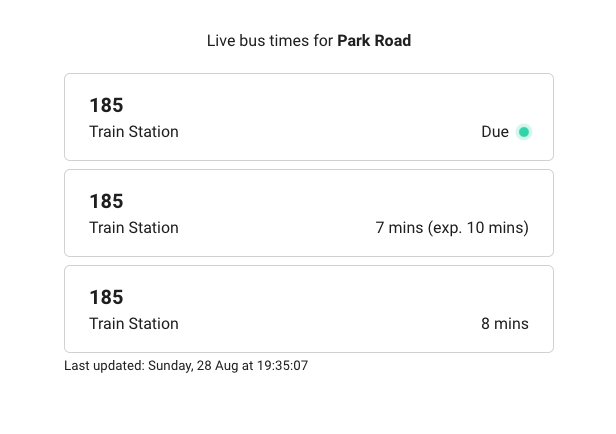

# Tandem Technical Test

Hello

This is my solution to the assessment. I completed each of the requirements and added a little flair which i've outlined in the improvements below.

When cloning project, be sure to run
```sh
npm install
```
on both web and api directors in order to install dependancies

**Improvements to the app**

Added improvements include

1. Add Jest api.controller.spec.ts test scripts to test api.controller.ts
   1. Run the test script in api directory
    ```sh
    npm run test
    ```
2. Add error handling to the API response if no busses run (such as weekends)
3. Add indicator if bus is due
4. Add 1 in 3 chance of bus being delayed with indication
5. Add 'Last updated' indicator
6. Add transition styles to card

**Suggested improvements**

Further improvements I would want to add to the application given time

1. Add bus route stops within an accordion. When the user clicks to open this it would display all stops with an indication as to where the bus is currently on it's journey.
2. Add select options so that the user can filter the cards by a bus number
3. Add calendar picker so the user can filter bus times on future dates
4. Add an input field so the user can filter busses by specific destination
5. Add a map with outlined route and location for each bus route
6. Add a delayed / cancelled indicator
7. Add more get endpoints so the user can query different days and busId routes


**Project structure**

Web - React TypeScript application accessible at http://localhost:8080. Generated with Vite (similar to Create React App).

API - Node.js TypeScript application accessible at http://localhost:3000. Generated with Nest.JS framework (similar to Express.js).

## Requirements

- The app should fetch and display bus times from the existing `\bus-times` API endpoint on page load
- The app should highlight when buses are due (1 minute or less til arrival)
- The app should automatically refetch the bus times every 10 seconds
- The user should only see routes that run on the current day of the week
- The app should match the design outlined in the mockup below

Additionally, what are some other ways you might want to improve or extend this application? This could include changes to the user experience, front-end and/or back-end. Feel free to leave comments or implement these changes if you have time.

**Solution**
